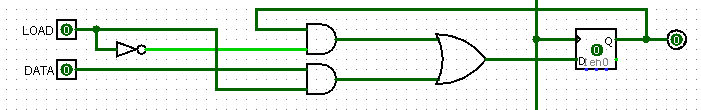
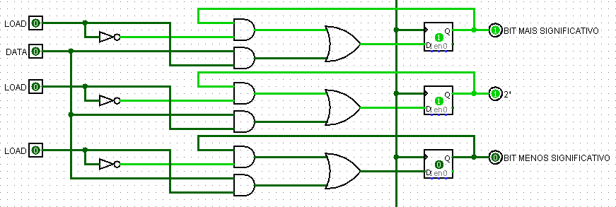

# Eletrônica Digital

Repositório destinado ao estudo de conceitos da eletrônica digital

## ROADMAP

### Conceitos

1. [Sistemas numéricos](./anotacoes/01-SistemasNumericos.md)
2. [Portas lógicas e Propriedades da lógica booleana](./anotacoes/02-PortasEPropriedades.md)
3. [Simplificação e redução de funções](./anotacoes/03-Simplificacao.md)
4. [Circuitos sequencias](./anotacoes/04-CircuitoSeq.md)

### Simulando

1. [Decodificador com display de 7 segmentos](./anotacoes/11-Decodificador.md)
2. [Partida e Alarme](./anotacoes/12-PartidaEAlarme.md)

* **Registradores**

A utilização do flip-flop sem conexão com outros circuitos lógicos faz com que o dado sempre se atualize de acordo com o barramento de dados a cada borda de clock. Com o intuito de utilizá-lo para construir memórias capazes de armazenar diferentes dados (exemplo: armazenar o número 6 exigiria 3 flip-flop's, no entanto nem todos deveriam armazenar o mesmo bit) é implementado um circuito lógico que apresenta um novo barramento, o de load.

Esse novo bit a ser enviado definirá se o dado que está no barramento de dados será salvo naquela flip-flop (Q-next = D) ou então o flip-flop manterá o dado anterior (Q-next = Q).

|Barramento de dados|Load|Q|Q-next|
|:---:|:---:|:---:|:---:|
|**0**|**0**|0|0|
|**0**|**0**|1|1|
|**0**|**1**|0|0|
|**0**|**1**|1|0|
|**1**|**0**|0|0|
|**1**|**0**|1|1|
|**1**|**1**|0|1|
|**1**|**1**|1|1|

Portanto, observa-se que o flip-flop agora é capaz de manter seu próprio bit mesmo quando o barramento de dados altera seu valor - tornando possível construir uma memória. Assim se torna possível armazenar representações binárias que então podem passar por decodificadores e chegarem na base desejada.

### **Projeto: Computer Clock**

Componentes utilizados:

- LM555/NE555: Temporizador
- Resistores (R1 e R2): 1k para R1 (corrente apenas na recarga) e 100k (potenciometro - recarga e descarga)
- Capacitores (C, C1 e C2): 1uF (capacitor a influenciar no ciclo do clock), 10nF e 100nF (C1 e C2 - a fim de reduzir ruídos nas bordas de subida)
- Não obrigatórios: LED e resistor limitador de corrente (para observar a saída do temporizador de maneira visual)

Para iniciar a construção de pequenos projetos se deve inicialmente se atentar em como será realizada a **alimentação** do mesmo (o qual será inserido em uma matriz de contato - conhecido também como protoboard); a opção inicialmente selecionada se trata da utilização de um carregador de celular, assim aproveitando sua construção interna* para aproveitar **5V de saída****.

`*`Transformador: responsável por diminuir a tensão de entrada; Retificador: responsável por transformar sinal AC em DC

`**`Deve-se atentar a corrente máxima permitida, visto que tais aparelhos são mais limitados em comparação com fontes dedicadas e ajustáveis

### **Projeto: Registrador**

Componentes utilizados:

- Sinal de clock;
- Flip-Flop's do tipo D (ou então SR requisitando uma porta NOT)
- CI's de portas lógicas (NOT, AND e OR);
- Resistores de pull-down (correção de problema de flutuação a ser citado);
- Não obrigatórios: LED c/ resistor limitador de corrente.

- **Flutuação**

Entradas podem sofrer oscilações, sendo assim capaz de afetar a lógica de ser aplicada nos CI's, uma vez que uma tensão diferente pode influenciar os transistores a trabalharem de um modo diferente. Isso ocorre com  as portas lógicas, onde há a necessidade da inserir resistores de pull-down - para assim, evitar tais flutuações e evitar falhas em sua saída.

No entanto não há a necessidade de tais resistores para evitar tais flutuações em entradas dependentes; tais parecem sair sem quaisquer oscilação capaz de comprometer a próxima lógica a ser seguida.

Outra flutuação que pode ocorrer na prática se trata da entrada de reset no CI do flip-flop do tipo D (a qual ocorre com ativação em baixo nível). Para a solução deste caso foi necessário colocar o reset (MR') em 5V, assim como recomendado no datasheet - em caso de não uso da entrada.

- **Extensão**

Além dos LED's demonstrando a saída de um número em binário, pode-se construir diferentes circuitos a fim que cada um traduza tal sequência de bits em um número real - utilizando a ideia do decodificador para o display de 7 segmentos.

Cada circuito a ser integrado ao registrador pode apresentar diferentes resoluções, assim como uma destinação de espaço na memória realiza ao ser requisitado, como em uma declaração de variável.

**UNSIGNED INT**: nesse caso o decodificador transformará o conjunto de bits em um número inteiro *positivo* (devido a declaração de unsigned).

**SIGNED INT**: aqui certas possibilidades são destinadas a serem interpretadas como um número inteiro *negativo*.

**FIXED POINT**: um bit será destinado a identificar o valor de sinal (**+**[1] ou **-**[0]), um byte para o dígito a esquerda da vírgula (parte inteira) enquanto outros 2 bytes para os valores a direita (parte fracionária).

---