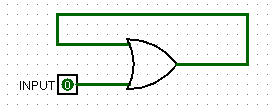
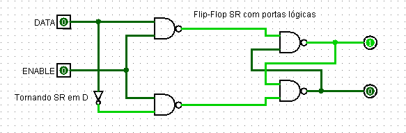
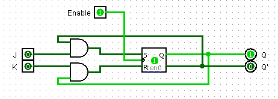

# Eletrônica Digital

Repositório destinado a anotações de conceitos de eletrônica digital

Tópicos
-

### **Sistemas Numéricos** 
[*Arquivo em js*](./Sistemas-Numericos.js)

Conversão para binário: 
```
function BasesEmBinarios(num, base){...}
```

Essa conversão pode ocorrer apenas da base octal e hexadecimal para a binária, visto que desse modo é necessário encontrar o equivalente de cada dígito da base para a nova (no caso base 2).

Exemplo: 801 em octal representa 111000001 em binário - sendo que 8 representa 111, 0 é o mesmo de 000 e 1 o de 001.

*Detalhe*: observando a base binária percebe-se os diferentes pesos para cada dígito (assim como no decimal, no qual partimos de unidade e passamos por dezena, centena, milhar e etc.), portanto se pode entender que diferentes bases requisitam diferentes quantidades de dígitos. `Octal requisita 3 bits` [2^3 de possibilidades] (000 - sendo o zero - até 111 - sendo o oito). `Hexadecimal requisita 4`  [2^4 de possibilidades] (0000 - zero - até 1111 - 15 ou F).

### **Portas Lógicas**
[*Arquivo em js*](./Portas-Logicas.js)

### **Propriedades e Teoremas da Álgebra Booleana**

|  | Teorema (AND) | Teorema (OR) |
|:-:|:-:|:-:|
| Identidade  | 1A = A | 1 + A = 1 |
| Null  | 0A = 0  | 0 + A = A |
| Complemento | A*A' = 0 | A + A' = 1 |
| Distributiva  | A **+** B`*`C = A **+** B `*` A **+** C  | A **.** (B`+`C) = A **.** B  `+` A **.** C |
| Absorção | A(A+B) = A | A + (AB) = A |
| De Morgan | (AB)' = A' + B' | (A+B)' = A'B' |

Coluna OR, vale destacar: `A + A = A` (uma variável somada a si mesma permanece igual - uma vez que existem apenas dois níveis lógicos, em casos de **baixo ou baixo** resultam numa saída de baixo nível enquanto para **alto ou alto** apresentam uma saída de alto nível)

Coluna AND, vale destacar: `A * A' = 0` (variável multiplicando seu complemento é igual a zero - visto que necessariamente uma entrada estará em baixo nível lógico, é definido que **alto(1) * baixo(0) = baixo(0)**)

Distributiva: Referente a coluna OR é mais aceitável por conta de funcionar também em cálculos não booleanos; Para a soma entre variável e multiplicação de variáveis, pode-se definir que diz o mesmo que a multiplicação da somas (distruídas).

Teorema De Morgan: Define que uma negação pode ser "quebrada" desde que a operação se inverta - como se a negação da soma seja a multiplicação e vice versa.

### **Simplificações/Reduções**

MINTermos e MAXTermos

Visualizando uma tabela verdade - a qual representa a saída de uma função de acordo com N entradas - é possível retirar expressões de acordo com cada linha; no entanto há maneiras diferentes e seu uso pode mudar as portas lógicas e entradas necessárias.

1. [MAXTermos]()

Nesse caso é definido que a análise estará direcionada às saídas de alto nível lógico. A definição da `expressão` de cada linha (de maneira individual) se dá pela `multiplicação das entradas` (entradas de **alto** nível lógico se mantem **intactas**, enquanto entradas de **baixo** nível devem ser considerdas **negadas**). Por fim, `soma-se as expressões` (porta OR).

2. [MINTermos]()

Aqui se analisa as saídas de baixo nível. Cada linha terá sua `expressão` como a `soma das entradas` (entradas de **alto** nível entram como **negadas**, enquanto de **baixo** nível lógico entram **constante**). Ao final, `multiplica-se as expressões` obtidas (porta AND).

### **Mapa Karnaugh**
[*Arquivo em js*](./Mapa-Karnaugh.js)

### **Projeto: Decodificador 7-Display-Segment**

Para este caso foi entendido que sua aplicação, visto os recursos disponíveis, seria apenas possível em um simulador - **LogSim** foi o utilizado.

#### **Esquematização**

Inicialmente foi construído uma tabela verdade para compreender o status de cada segmento de acordo com a entrada binária.


|BIT 4|BIT 3|BIT 2|BIT 1|a|b|c|d|e|f|g|
|:---:|:---:|:---:|:---:|:---:|:---:|:---:|:---:|:---:|:---:|:---:|
|**0**|**0**|**0**|**0**|||||||0|
|**0**|**0**|**0**|**1**||1|1|||||
|**0**|**0**|**1**|**0**|||0|||0||
|**0**|**0**|**1**|**1**|||||0|0||
|**0**|**1**|**0**|**0**|0|||0|0|||
|**0**|**1**|**0**|**1**||0|||0|||
|**0**|**1**|**1**|**0**||0||||||
|**0**|**1**|**1**|**1**|1|1|1|||||
|**1**|**0**|**0**|**0**|1|1|1|1|1|1|1|
|**1**|**0**|**0**|**1**|||||0|||
|**1**|**0**|**1**|**0**||||0||||
|**1**|**0**|**1**|**1**|0|0||||||
|**1**|**1**|**0**|**0**||0|0||||0|
|**1**|**1**|**0**|**1**|0|||||0||
|**1**|**1**|**1**|**0**||0|0|||||
|**1**|**1**|**1**|**1**||0|0|0||||

Após o término da tabela verdade, realizou-se a redução da função através da construção de um Mapa de Karnaugh para cada saída e então foi obtido:

````
a: (B4' + B3' + B2 + B1') * (B4' + B3 + B2' + B1') * (B4 + B3 + B2 + B1') * (B4 + B3' + B2 + B1)

b: (B4' + B2' + B1') * (B4' + B3' + B1) * (B3' + B2' + B1) * (B4 + B3' + B2 + B1')

c: (B4' + B3' + B2') * (B4' + B3' + B1) * (B4 + B3 + B2' + B1)

d: (B4 + B3' + B2 + B1) * (B4' + B3 + B2' + B1) * (B3' + B2' + B1') * (B4 + B3 + B2 + B1')

e: (B4 + B3 + B1') * (B4 + B3' + B2) * (B3 + B2 + B1') * (B4 + B2' + B1')

f: (B4 + B3 + B1') * (B4 + B3 + B2') * (B4 + B2' + B1') * (B4' + B3' + B2 + B1')

g: (B2 * B1') + (B4 * B3') + (B4 * B1) + (B3' * B2) + (B4' * B3 * B2')

````

### **Projeto: Acionamento de motor e alarme de carro**

|Embreagem|Chave Partida|PARTIDA|
|:---:|:---:|:---:|
|**0**|**0**|0|
|**0**|**1**|0|
|**1**|**0**|0|
|**1**|**1**|1|

`MOTOR(PARTIDA) = Embreagem * Chave Partida`

|Motor|Porta|Cinto|Farol|ALARME|LED|
|:---:|:---:|:---:|:---:|:---:|:---:|
|**0**|**0**|**0**|**0**|0|0|
|**0**|**0**|**0**|**1**|0|1|
|**0**|**0**|**1**|**0**|0|0|
|**0**|**0**|**1**|**1**|0|1|
|**0**|**1**|**0**|**0**|0|1|
|**0**|**1**|**0**|**1**|0|1|
|**0**|**1**|**1**|**0**|0|1|
|**0**|**1**|**1**|**1**|0|1|
|**1**|**0**|**0**|**0**|0|0|
|**1**|**0**|**0**|**1**|0|0|
|**1**|**0**|**1**|**0**|1|0|
|**1**|**0**|**1**|**1**|1|0|
|**1**|**1**|**0**|**0**|1|0|
|**1**|**1**|**0**|**1**|1|0|
|**1**|**1**|**1**|**0**|1|1|
|**1**|**1**|**1**|**1**|1|1|

```
Porta (0) = Fechada; Porta(1) = Aberta

Cinto (0) = Em uso; Cinto(1) = Solto

Farol (0) = Apagado; Farol(1) = Aceso
```

`ALARME = (Motor * Cinto) + (Motor * Porta)`

`LED = (Motor' * Farol) + (Motor' * Porta)`

Sem o acionamento do motor, alertar que há algo de errado apenas com o LED.

Com o motor ligado, alertar com apenas alarme quando porta ou cinto inadequados e com duplo alerta (alarme + led) quando porta e cinto inadequados.

*Necessita acionar uma memória, senão será necessário manter a chave na posição correta e a embreagem acionada para o motor não desligar.*

* **Circuitos Sequencias**

Diferentemente dos circuitos combinacionais vistos anteriormente, o qual depende apenas e exclusivamente dos estados lógicos das entradas, os sequenciais são dependentes da sua *própria saída* (como uma realimentação).

Todos circuitos sequencias podem ser conhecidos pela sua **memorização**, um exemplo simples de memória - de certa forma ineficaz - é uma porta OR com 2 entradas: uma independente e a outra a saída da própria porta. 



Iniciando este exemplo com baixo nível lógico a saída será igual a entrada sem dependência; ao subir o estado lógico para alto a saída passará para alto também. Ao reduzir o nível de input para baixo a saída continuará como alta; isso pode ser facilmente comprovado pelo postulado `A + 1 = 1`. Portanto, pode-se compreender como uma memória que armazena se determinada **entrada**, pelo menos uma vez, *esteve* em **alto** estado lógico.

* **Clock**

A fim de entender como salvar um bit de memória, deve-se compreender primeiramente o que é o clock. 

O clock se trata de um sistema oscilador (de maneira visual seria uma função de onda quadrada) utilizado para sincronizar e controlar o fluxo de operações em sistemas digitais. Nos circuitos integrados funciona como uma `entrada/input habilitadora`, sendo essencial no processo de *ativar* as portas lógicas presentes no CI.


*as duas portas à esquerda representam a ativação (clock coincide, obviamente, nas duas), enquanto as portas NOR representam um CI*


* **Flip-Flop's**

Os flip-flop's podem possuir diferentes conceitos/modelos.

````
"SR" (set/reset) acionar e desacionar saída;
"D" (data) armazenar dados;
"JK".
````

Esses modelos tipicamente possuem o sinal de clock e podem variar acerca da quantidade de sinais de entrada e de saída. Quanto as saídas, elas se resumem a no máximo 2 - na qual uma pode ser o complemento/negação da outra; já as entradas podem variar de acordo com o modelo específico.

**Flip-Flop SR**
|SET|RESET|Q-next|
|:---:|:---:|:---:|
|**0**|**0**|Q|
|**0**|**1**|0|
|**1**|**0**|1|
|**1**|**1**|Indeterminada|

Para set e reset em **baixo nível lógico**, temos o flip-flop funcionando em estado de **memória** - mantendo o nível lógico previamente salvo; a entrada *(1,1)* se trata de uma ocasião *inválida* e que deve ser evitada.

**Flip-Flop D**

O flip-flop do tipo "D" pode possuir até 3 diferentes entradas, sendo elas: entrada de dado, set e reset (um definindo a memória como 0 e o outro como 1 - variam de modelos). A saída é atualizada após cada subida do clock e de acordo com o input de dado - sendo que D(entrada) = Q-next(saída após uma borda de subida no clock) ou que Q-next = Q(quando o clock está constante ou em borda de descida).

|Data|Clock|Q-next|
|:---:|:---:|:---:|
|0|Memorização (↓)|Q|
|1|Memorização (↓)|Q|
|0|Armazenar (↑)|0|
|1|Armazenar (↑)|1|

*Armazenar o dado de entrada na saída ocorre na subida de clock (em alguns casos pode ser na descida), nos demais casos o CI funciona na parte de memorização - não alterando o dado salvo previamente.*

A idealização de um flip-flop tipo D ocorre através de uma pequena alteração utilizando o tipo SR. Isso ocorre ao tornar as entradas set e reset em comum (tornando uma só: `data`), no entanto com uma porta inversora no sentido set → reset; sendo assim (considerando que o set deixa a saída em alta) teremos apenas duas ocasiões de entrada:

```
Para data = 0, set será 0 e reset 1. Assim armazenando 0

Para data = 1, set será 1 e reset 0. Assim armazenando 1.
```



Esse exemplo demonstra um **Latch D**, sua diferença é que o seu estado, de memorizar ou armazenar, depende do **nível de entrada** do enable/clock (0: armazena; 1: salva o dado); enquanto que no flip-flop a transição para armazenar o dado ocorre quando há uma borda de subida (se a entrada for negada, a atualização ocorre na descida).

Simulação de um latch D, sob a perspectiva de portas lógicas, armazenando um bit de memória:


**Flip-Flop JK**

Trata-se de uma evolução do tipo Set/Reset, a qual não apresenta mais a condição inválida. Neste modelo, com as entradas (1,1) as saídas Q e Q'ficam se alternando e nunca ficam de mesmo nível lógico; sendo assim nunca viola o postulado `Q . Q' = 0`.

|Clock|J (jump)|K (kill)|Q-next|
|:---:|:---:|:---:|:---:|
|**n/ borda de subida**|X|X|Q|
|**↑**|**0**|**0**|Q - Estado de memória|
|**↑**|**0**|**1**|0 - Reset|
|**↑**|**1**|**0**|1 - Set|
|**↑**|**1**|**1**|Q' - Toggle/Variação|



Para a concepção do **Projeto: Acionamento de motor e alarme de carro**, o necessário seria um `flip-flop SR`. Através da alteração do nível lógico das entradas seria possível alterar o estado de memória (que salvará se o motor está ligado ou não). Para encerrar o motor será necessário um interruptor para ativar a outra entrada (se *set* ativa, *reset* desativa - ou vice versa).


* **Registradores**

Componentes utilizados:

- Clock (+400 pinos de protoboard)
- Resistores (R1 e R2): 1k para R1 (corrente apenas na recarga) e 100k (potenciometro - recarga e descarga)
- Capacitores (C, C1 e C2): 1uF (capacitor a influenciar no ciclo do clock), 10nF e 100nF (C1 e C2 - a fim de reduzir ruídos nas bordas de subida)
- Não obrigatórios: LED e resistor limitador de corrente (para observar a saída do temporizador de maneira visual)

A utilização do flip-flop sem conexão com outros circuitos lógicos faz com que o dado sempre se atualize de acordo com o barramento de dados a cada borda de clock. Com o intuito de utilizá-lo para construir memórias capazes de armazenar diferentes dados (exemplo: armazenar o número 6 exigiria 3 flip-flop's, no entanto nem todos deveriam armazenar o mesmo bit) é implementado um circuito lógico que apresenta um novo barramento, o de load.

Esse novo bit a ser enviado definirá se o dado que está no barramento de dados será salvo naquela flip-flop (Q-next = D) ou então o flip-flop manterá o dado anterior (Q-next = Q).


|Barramento de dados|Load|Q|Q-next|
|:---:|:---:|:---:|:---:|
|**0**|**0**|0|0|
|**0**|**0**|1|1|
|**0**|**1**|0|0|
|**0**|**1**|1|0|
|**1**|**0**|0|0|
|**1**|**0**|1|1|
|**1**|**1**|0|1|
|**1**|**1**|1|1|

Portanto, observa-se que o flip-flop agora é capaz de manter seu próprio bit mesmo quando o barramento de dados altera seu valor - tornando possível construir uma memória. Assim se torna possível armazenar representações binárias que então podem passar por decodificadores e chegarem na base desejada.


### **Projeto: Computer Clock**

Componentes utilizados:

- LM555/NE555: Temporizador
- Resistores (R1 e R2): 1k para R1 (corrente apenas na recarga) e 100k (potenciometro - recarga e descarga)
- Capacitores (C, C1 e C2): 1uF (capacitor a influenciar no ciclo do clock), 10nF e 100nF (C1 e C2 - a fim de reduzir ruídos nas bordas de subida)
- Não obrigatórios: LED e resistor limitador de corrente (para observar a saída do temporizador de maneira visual)

Para iniciar a construção de pequenos projetos se deve inicialmente se atentar em como será realizada a **alimentação** do mesmo (o qual será inserido em uma matriz de contato - conhecido também como protoboard); a opção inicialmente selecionada se trata da utilização de um carregador de celular, assim aproveitando sua construção interna* para aproveitar **5V de saída****.

`*`Transformador: responsável por diminuir a tensão de entrada; Retificador: responsável por transformar sinal AC em DC
`**`Deve-se atentar a corrente máxima permitida, visto que tais aparelhos são mais limitados em comparação com fontes dedicadas e ajustáveis

---