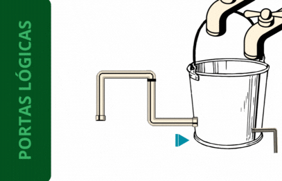

## **Portas Lógicas**
[*Arquivo em js*](../Portas-Logicas.js)

Ao trabalhar em cenários que funcionem com apenas duas hipoteses, como ligado e desligado, verdadeiro e falso, aberto e fechado, dentre outros, é possível encontrar diversos equipamentos. Os dispositivos de famílias lógicas são aqueles capazes de tornar tal sistema executável na prática, podendo incluir desde as portas lógicas até aparelhos que funcionem com base na diferença de pressão.

Um dos componentes popularizados no primórdio da computação se tratava dos relés, os quais podem ser ditos como interruptores mecânicos - permitindo ou não a passagem de corrente. De tal forma o relé seguia a lógica computacional com as possibilidades de circuito aberto ou de circuito fechado, sendo assim possibilitando a aplicação de computadores - uma vez que tais se baseiam nesse príncipio.


Como demonstrado na figura o relé fica no estado "normalmente fechado" quando o relé está desativado. Ao aplicar uma diferença de potencial na bobina, a mesma irá criar um campo magnético capaz de atrair a armadura e então mudar para seu estado "normalmente aberto". Neste segundo caso é dito que a corrente puderá fluir do comum até o restante de um próximo circuito.

A depender da escolha do dispositivo da família lógica o seu computador pode possuir diferentes escalas físicas, maiores ou menores. Um fator que foi considerado ao longo dos anos, para que então houvesse um funcionamento mais eficaz, foi a respeito da velocidade que esta informação (aberto e fechado) era passada. No exemplo anterior o tamanho de sua aplicação era em grandes dimensões e apresentava uma limitação na quantidade de transições, assim desacelerando o processo como um todo.

A computação atualmente é vista intrissicamente ligada à eletricidade, no entanto é possível praticá-la com qualquer meio que permite a lógica descrita acima. Um exemplo possível de aplicar este conceito sem o uso da eletricidade é por meio de elementos primários, como ar e água.



Observando este exemplo é possível definir uma tabela, relacionando as 2 entradas (parte superior da imagem) com a saída (parte inferior esquerda), da seguinte forma:

|Entrada 1|Entrada 2|Saída|
|:---:|:---:|:---:|
|Fechada|Fechada|Fechada|
|Aberta|Fechada|Fechada|
|Fechada|Aberta|Fechada|
|Aberta|Aberta|Aberta|

Ao observar essas informações é possível compreender a propriedade que a rege. Neste exemplo a saída só será verdadeira (aberta, fluxo de água, etc.) quando **ambas** entradas estiverem **ativas**, ou seja, é compreendido como uma porta lógica AND.

Outras portas lógicas bases apresentam as seguintes tabelas verdade:

- XOR

Pode ser compreendida como a saída presente no canto inferior direito da animação anterior, sendo verdadeiro quando apenas uma das duas entradas está em seu alto nivel. Apesar de, no caso em que ambas estão ativas, haver também uma saída, compreende-se que esse volume é um ruído, uma vez que a quantidade majoritária sairá pela outra tubulação (de maior diâmetro).

| Entrada A | Entrada B | Saída XOR |
|:---------:|:---------:|:--------:|
|    0      |    0      |    0     |
|    0      |    1      |    1     |
|    1      |    0      |    1     |
|    1      |    1      |    0     |

- OR

| Entrada A | Entrada B | Saída OR |
|:---------:|:---------:|:-------:|
|    0      |    0      |    0    |
|    0      |    1      |    1    |
|    1      |    0      |    1    |
|    1      |    1      |    1    |

- NOT

| Entrada | Saída NOT |
|:-------:|:---------:|
|   0     |    1      |
|   1     |    0      |

- NAND

| Entrada A | Entrada B | Saída NAND |
|:---------:|:---------:|:---------:|
|    0      |    0      |     1     |
|    0      |    1      |     1     |
|    1      |    0      |     1     |
|    1      |    1      |     0     |

- NOR

| Entrada A | Entrada B | Saída NOR |
|:---------:|:---------:|:--------:|
|    0      |    0      |    1     |
|    0      |    1      |    0     |
|    1      |    0      |    0     |
|    1      |    1      |    0     |

## **Propriedades e Teoremas da Álgebra Booleana**

|  | Teorema (AND) | Teorema (OR) |
|:-:|:-:|:-:|
| Identidade  | 1A = A | 1 + A = 1 |
| Null  | 0A = 0  | 0 + A = A |
| Complemento | A*A' = 0 | A + A' = 1 |
| Distributiva  | A * (B+C) = A * B  + A * C | A + (B*C) = A+B * A+C |
| Absorção | A(A+B) = A | A + (AB) = A |
| De Morgan | (AB)' = A' + B' | (A+B)' = A'B' |

### Coluna OR

Vale destacar: `A + A = A` (uma variável somada a si mesma permanece igual - uma vez que existem apenas dois níveis lógicos, em casos de **baixo ou baixo** resultam numa saída de baixo nível enquanto para **alto ou alto** apresentam uma saída de alto nível)

### Coluna AND

Vale destacar: `A * A' = 0` (variável multiplicando seu complemento é igual a zero - visto que necessariamente uma entrada estará em baixo nível lógico, é definido que **alto(1) * baixo(0) = baixo(0)**)

### Distributiva

Referente a coluna OR é mais aceitável por conta de funcionar também em cálculos não booleanos; Para a soma entre variável e multiplicação de variáveis, pode-se definir que diz o mesmo que a multiplicação da somas (distruídas).

### Absorção

A prova deste postulado é dada com o uso da distributividade:

```
A*(A+B) = A

A*A + A*B
A + 0
A
```

```
A+(A*B) = A

A+A * A+B
A * 1
A
```

### Teorema De Morgan

O teorema de De Morgan é uma regra da álgebra booleana que descreve a negação de uma operação de conjunto como a operação de conjunto negado, ou seja, afirma que uma sentença negada equivale a uma mesma com os termos divididos/separados - sendo cada um deles negados, tanto entradas como operadores (OR se torna AND e vice-versa).

Em termos práticos:

`(A + B)' = A' * B'`

`(A * B * C)' = A' + B' + C'`

[Voltar](01-SistemasNumericos.md) / [Continuar](03-Simplificacao.md)