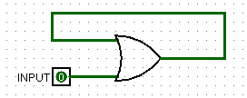
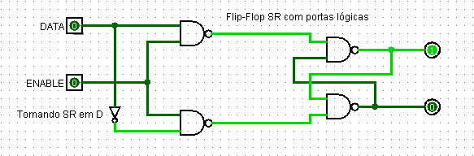
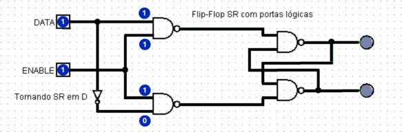

## **Circuitos Sequencias**

Diferentemente dos circuitos combinacionais vistos anteriormente, o qual depende apenas e exclusivamente dos estados lógicos das entradas, os sequenciais são dependentes da sua *própria saída* (como uma realimentação).

Todos circuitos sequencias podem ser conhecidos pela sua **memorização**, um exemplo simples de memória - de certa forma ineficaz - é uma porta OR com 2 entradas: uma independente e a outra a saída da própria porta. 



Iniciando este exemplo com baixo nível lógico a saída será igual a entrada sem dependência; ao subir o estado lógico para alto a saída passará para alto também. Ao reduzir o nível de input para baixo a saída continuará como alta; isso pode ser facilmente comprovado pelo postulado `A + 1 = 1`. Portanto, pode-se compreender como uma memória que armazena se determinada **entrada**, pelo menos uma vez, *esteve* em **alto** estado lógico.

## **Clock**

A fim de entender como salvar um bit de memória, deve-se compreender primeiramente o que é o clock. 

O clock se trata de um sistema oscilador (de maneira visual seria uma função de onda quadrada) utilizado para sincronizar e controlar o fluxo de operações em sistemas digitais. Nos circuitos integrados funciona como uma `entrada/input habilitadora`, sendo essencial no processo de *ativar* as portas lógicas presentes no CI.


*as duas portas à esquerda representam a ativação (clock coincide, obviamente, nas duas), enquanto as portas NOR representam um CI*


## **Flip-Flop's**

Os flip-flop's podem possuir diferentes conceitos/modelos.

````
"SR" (set/reset) acionar e desacionar saída;
"D" (data) armazenar dados;
"JK".
````

Esses modelos tipicamente possuem o sinal de clock e podem variar acerca da quantidade de sinais de entrada e de saída. Quanto as saídas, elas se resumem a no máximo 2 - na qual uma pode ser o complemento/negação da outra; já as entradas podem variar de acordo com o modelo específico.

### **Flip-Flop SR**
|SET|RESET|Q-next|
|:---:|:---:|:---:|
|**0**|**0**|Q|
|**0**|**1**|0|
|**1**|**0**|1|
|**1**|**1**|Indeterminada|

Para set e reset em **baixo nível lógico**, temos o flip-flop funcionando em estado de **memória** - mantendo o nível lógico previamente salvo; a entrada *(1,1)* se trata de uma ocasião *inválida* e que deve ser evitada.

### **Flip-Flop D**

O flip-flop do tipo "D" pode possuir até 3 diferentes entradas, sendo elas: entrada de dado, set e reset (um definindo a memória como 0 e o outro como 1 - variam de modelos). A saída é atualizada após cada subida do clock e de acordo com o input de dado - sendo que D(entrada) = Q-next(saída após uma borda de subida no clock) ou que Q-next = Q(quando o clock está constante ou em borda de descida).

|Data|Clock|Q-next|
|:---:|:---:|:---:|
|0|Memorização (↓)|Q|
|1|Memorização (↓)|Q|
|0|Armazenar (↑)|0|
|1|Armazenar (↑)|1|

*Armazenar o dado de entrada na saída ocorre na subida de clock (em alguns casos pode ser na descida), nos demais casos o CI funciona na parte de memorização - não alterando o dado salvo previamente.*

A idealização de um flip-flop tipo D ocorre através de uma pequena alteração utilizando o tipo SR. Isso ocorre ao tornar as entradas set e reset em comum (tornando uma só: `data`), no entanto com uma porta inversora no sentido set → reset; sendo assim (considerando que o set deixa a saída em alta) teremos apenas duas ocasiões de entrada:

```
Para data = 0, set será 0 e reset 1. Assim armazenando 0

Para data = 1, set será 1 e reset 0. Assim armazenando 1.
```



Esse exemplo demonstra um **Latch D**, sua diferença é que o seu estado, de memorizar ou armazenar, depende do **nível de entrada** do enable/clock (0: armazena; 1: salva o dado); enquanto que no flip-flop a transição para armazenar o dado ocorre quando há uma borda de subida (se a entrada for negada, a atualização ocorre na descida).

Simulação de um latch D, sob a perspectiva de portas lógicas, armazenando um bit de memória:



### **Flip-Flop JK**

Trata-se de uma evolução do tipo Set/Reset, a qual não apresenta mais a condição inválida. Neste modelo, com as entradas (1,1) as saídas Q e Q'ficam se alternando e nunca ficam de mesmo nível lógico; sendo assim nunca viola o postulado `Q . Q' = 0`.

|Clock|J (jump)|K (kill)|Q-next|
|:---:|:---:|:---:|:---:|
|**n/ borda de subida**|X|X|Q|
|**↑**|**0**|**0**|Q - Estado de memória|
|**↑**|**0**|**1**|0 - Reset|
|**↑**|**1**|**0**|1 - Set|
|**↑**|**1**|**1**|Q' - Toggle/Variação|


[Voltar](03-Simplificacao.md) / [Continuar](11-Decodificador.md)