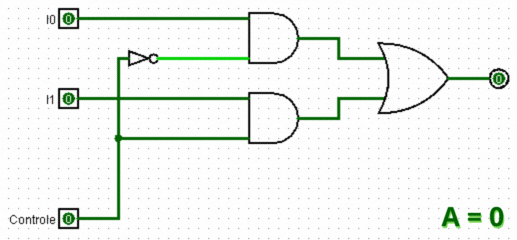
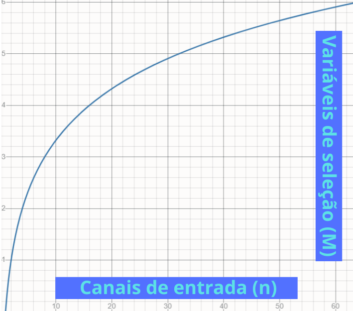
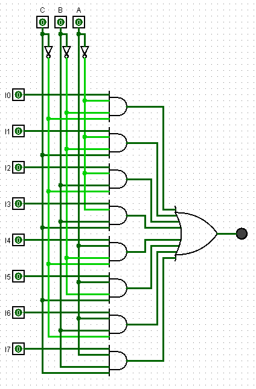
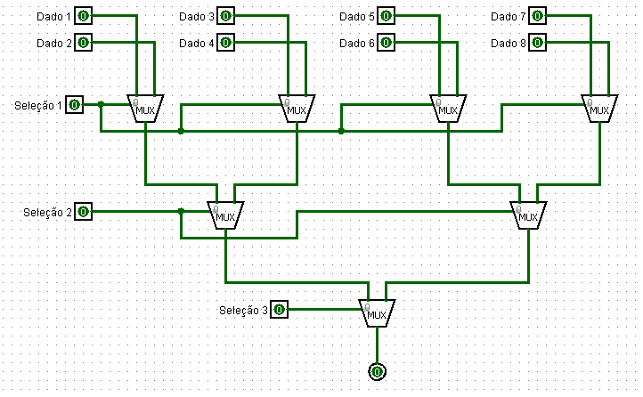
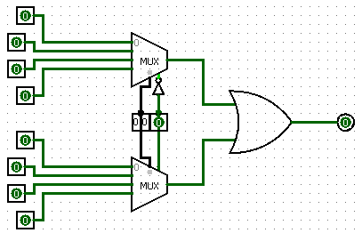
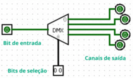

## Multiplexadores

Uma das vantagens do uso de sinais digitais sobre os analógicos é o fato de sua transmissão ser menos propensa à ruídos, uma vez que o receptor tem de decidir apenas entre dois valores. Todavia, uma complexidade para estes sistemas é a necessidade da transmissão de diversas informações simultâneas - uma vez que esses sinais, muitas vezes, são transmitidos por uma quantidade finita de meios (sejam eles a fibra óptica, onda de rádio ou até os cabos marítimos).

Para solucionar tal empecilho foi criado os multiplexadores, os quais são formados com base em dois dispositivos. O **multiplexador**, ou simplesmente MUX, é responsável por combinar diversas informações (input) em um único link e o transmitir pelo canal, enquanto o **demultiplexador**, na outra extremidade, recebe várias informações separando-os em quantos canais necessários e assim entregando para as linhas apropriadamente (output).


*Nesta imagem é possível entender o multiplexador como uma chave seletora da informação a ser transmitida*

### **Multiplexador**

A composição de um multiplexador é dada pelos sinais de entradas e os de controle. As entradas de controle serão responsáveis por determinar qual informação será transmitida, determinando assim que os sinais de entrada são ligados um por vez - enquanto os demais permanecem desconectados. Por conta disso que esses aparelhos são sempre descritos como X:1, sendo X a quantidade de inputs e 1 sendo a saída única de comunicação.

De maneira visual e por meio de portas lógicas é possível visualizar este controlador, sendo ele constituido por **n**¹ portas AND e apenas uma porta OR.

No simulador **LogSim** é possível obter um multiplexador de 2 canais de entrada e uma sinal de controle da seguinte maneira:

1 - Define-se a tabela verdade, escolhendo qual a informação será passada de acordo com o controle.

|A - Variável de Controle|S - Saída do Canal|
|:---:|:---:|
|0|I0 (entrada 0)|
|1|I1 (entrada 1)|

2 - A partir da tabela, é definido a função que a rege.

```
A'*I0 + A*I1
```

? - Extra

A visualização das informações expostas na tabela acima pode ser apresentada também da seguinte maneira:

|A|I0|I1|Y|
|:--:|:--:|:--:|:--:|
|0|0|0|0|
|0|0|1|0|
|0|1|0|1|
|0|1|1|1|
|1|0|0|0|
|1|0|1|1|
|1|1|0|0|
|1|1|1|1|

De tal maneira, ao obter os mintermos desta tabela, a função é definida como

```
A'*I0*I1'*1 + 
A'*I0*I1*1 + 

A*I0'*I1*1 + 
A*I0*I1* + 

...
```

Dito isso, pode-se reduzi-lá por meio de simplificações. Neste caso, especificamente, a única propriedade utilizada para a redução é a distributiva.

```
A'*I0(I1' + I1) = A'*I0 + 

A*I1(I0'*I0) = A*I1
```

Por fim é possível concluir que se pode encontrar a função regente de um multiplexador obtendo em mãos apenas uma tabela "simplificada", a qual apresenta as saídas correspondentes ao conjunto de bits das variáveis de controle.

3 - Montagem do circuito com base na função descrita.



Ao concluir este trecho, entende-se a equação dada anteriormente - relacionando número de entradas e número de controle; para um quantidade determinada de variáveis de input, obrigatoriamente deverá ter uma quantidade específica de varíaveis de controle e vice-versa.

De maneira semelhante é possível ver essa relação no seguinte gráfico:


> `Para n = 2^M`



> `Para M = log2 (n)`

### MUX 8:1

A idealização de um multiplexador de 8:1 segue a mesma lógica, da seguinte maneira é definido:

Sendo **8** o número de **entradas**, é compreendido a necessidade de **3** portas **controladoras** (3 = log2 (8)).

|A|B|C|S|
|:---:|:---:|:---:|:---:|
|0|0|0|I0|
|0|0|1|I1|
|0|1|0|I2|
|0|1|1|I3|
|1|0|0|I4|
|1|0|1|I5|
|1|1|0|I6|
|1|1|1|I7|

```
A' * B' * C' * I0 + 
A' * B' * C * I1 + 
A' * B * C' * I2 + 
A' * B * C * I3 + 
A * B' * C' * I4 + 
A * B' * C * I5 + 
A * B * C' * I6 + 
A * B * C * I7
```



### MUX Tree

Em algumas ocasioões pode ser interessante, ou necessário, a utilização de multiplexadores de capacidades menores para confeccionar um modelo mais robusto. Para realizar tal transformação, necessariamente, deve-se saber a quantidade de MUX a serem escolhidas, para isso segue a seguinte lógica:

- Quantidade de entradas necessárias / Quantidades aceitas pelo MUX base a ser usado

- Repetir o processo por M vezes, reaproveitando o resultado da divisão anterior: Quantidades de entradas MUX base ^ M = Quantidade de entradas requisitadas

- Soma-se os valores

### MUX 8:1 usando 2:1

- Quantidades de entradas MUX base ^ M = Quantidade de entradas requisitadas
  > 2 ^ M = 8
  
  > M = 3

- 8 / 2 = 4

- 4 / 2 = 2

- 2 / 2 = 1

> 4 + 2 + 1 = 7 Multiplexadores necessários



Observando o comportamento deste MUX 8:1 é possível determinar sua tabela verdade, onde a saída poderá se alternar entre "Dado 1" até "Dado 8" e os bits de seleção envolverão 3 variáveis de seleção ("Seleção 1", "Seleção 2" e "Seleção 3").

Esta projeção é viável dessa maneira uma vez que coincide o número de variáveis de controle (MUX 8:1 requisitando **3**) com o número de conjuntos de multiplexadores (**3** linhas de MUX 2:1, informação obtida no primeiro tópico).

|Sel 1|Sel 2|Sel 3|S|
|:---:|:---:|:---:|:---:|
|0|0|0|Dado 1|
|0|0|1|Dado 5|
|0|1|0|Dado 3|
|0|1|1|Dado 7|
|1|0|0|Dado 2|
|1|0|1|Dado 6|
|1|1|0|Dado 4|
|1|1|1|Dado 8|

### MUX 8:1 usando 4:1 (Caso especial)

O impasse na composição de um 8:1 utilizando multiplexadores 4:1 é visto logo na projeção inicial, no qual é requsitidao o uso de 2,5 multiplexadores 4:1.

- Quantidades de entradas MUX base ^ M = Quantidade de entradas requisitadas
  > 4 ^ M = 8
  
  > M = 1.5

- 8 / 4 = 2

- 2/ 4 = 0,5

> 2 + 0,5 = 2,5 Multiplexadores necessários

Outra maneira de identificar se estamos lidando com um caso especial é verificando a relação de entradas que o multiplexador requer VS a quantidade que serão dispostas com o uso de um multiplexador de outra proporção. Ao comparar o número de variáveis de controle necessárias para um multiplexador 8:1 com o número de variáveis de controle disponíveis ao usar dois multiplexadores 4:1, podemos notar que o multiplexador a ser construído requer **3** variáveis de seleção, enquanto o multiplexador utilizado como referência para a construção disponibiliza **4** variáveis de controle.

Portanto, é essencial tomar uma medida que torne a aplicação viável. Tal medida pode ocorrer ao usar uma das variáveis de seleção como um interruptor de ligar/desligar para os multiplexadores por meio da entrada enable², tornando então possível realizar essa configuração.



### Demultiplexador

Uma vez entendido o multiplexador, fica mais fácil a compreensão do demultiplexador. Este circuito segue os mesmos princípios, no entanto a ordem de funcionamento é revertida, uma vez que, ao contrário do multiplexador, ele traduz uma informação de entrada.

|A|B|S0|S1|S2|S3|
|:---:|:---:|:---:|:---:|:---:|:---:|
|**0**|**0**|E|0|0|0|
|**0**|**1**|0|E|0|0|
|**1**|**0**|0|0|E|0|
|**0**|**1**|0|0|0|E|

Visualizando esta tabela verdade, percebe-se que se trata de um demux 1:4, ou seja, uma entrada (E) pode ser destinada para 4 diferentes canais (S0, S1, S2 e S3). A relação de proporcionalidade entre a quantidade de variáveis de controle com os canais de entrada presentes no multiplexador segue também no demulitplexador, todavia envolvendo os canais de saída; Assim para o caso desta tabela com duas variáveis de seleção, define-se que é possibilitado 4 canais de saída (n = 2 ^ 2).

A fim de obter a função que trata esta tabela é seguido a mesma ideia:

```
(A'* B' * S0) + (A' * B' * S1 (0)) + ... + 
(A' * B * S1) + (A' * B * S0(0)) + ... + 
(A * B' * S2) + (A * B' * S1(0)) + ... + 
(A * B * S3) + (A * B * S2(0)) + ...
```

Assim chegando em: 

```
(A'* B' * S0) + (A' * B * S1) + (A * B' * S2) + (A * B * S3)
```



[Voltar](04-CircuitoSeq.md) / [Continuar](06-Adder.md)

---

¹ *Esta quantidade está diretamente relacionada ao número de variáveis de seleção (n = 2^M), sendo n o número de canais de entrada - onde cada canal exige uma porta AND*.

² *Deve-se notar que em um dos MUXs é necessário utilizar o valor absoluto dessa variável, enquanto no outro é preciso interpretá-la como o complemento*.