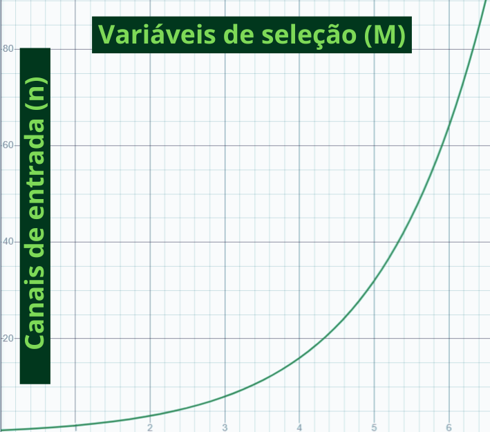

## Multiplexadores

Uma das vantagens do uso de sinais digitais sobre os analógicos é o fato de sua transmissão ser menos propensa à ruídos, uma vez que o receptor tem de decidir apenas entre dois valores. Todavia, uma complexidade para estes sistemas é a necessidade da transmissão de diversas informações simultâneas - uma vez que esses sinais, muitas vezes, são transmitidos por uma quantidade finita de meios (sejam eles a fibra óptica, onda de rádio ou até os cabos marítimos).

Para solucionar tal empecilho foi criado os multiplexadores, os quais são formados com base em dois dispositivos. O **multiplexador**, ou simplesmente MUX, é responsável por combinar diversas informações (input) em um único link e o transmitir pelo canal, enquanto o **demultiplexador**, na outra extremidade, recebe várias informações separando-os em quantos canais necessários e assim entregando para as linhas apropriadamente (output).


*Nesta imagem é possível entender o multiplexador como uma chave seletora da informação a ser transmitida*

### **Multiplexador**

A composição de um multiplexador é dada pelos sinais de entradas e os de controle. As entradas de controle serão responsáveis por determinar qual informação será transmitida, determinando assim que os sinais de entrada são ligados um por vez - enquanto os demais permanecem desconectados. Por conta disso que esses aparelhos são sempre descritos como X:1, sendo X a quantidade de inputs e 1 sendo a saída única de comunicação.

De maneira visual e por meio de portas lógicas é possível visualizar este controlador, sendo ele constituido por **n**¹ portas AND e apenas uma porta OR.

No simulador **LogSim** é possível obter um multiplexador de 2 canais de entrada e uma sinal de controle da seguinte maneira:

1 - Define-se a tabela verdade, escolhendo qual a informação será passada de acordo com o controle.

|A - Variável de Controle|S - Saída do Canal|
|:---:|:---:|
|0|I0 (entrada 0)|
|1|I1 (entrada 1)|

2 - A partir da tabela, é definido a função que a rege.

```
A'*I0 + A*I1
```

3 - Montagem do circuito com base na função descrita.


Ao concluir este trecho, entende-se a equação dada anteriormente - relacionando número de entradas e número de controle; para um quantidade determinada de variáveis de input, obrigatoriamente deverá ter uma quantidade específica de varíaveis de controle e vice-versa.

De maneira semelhante é possível ver essa relação no seguinte gráfico:



`Para n = 2^M`


`Para M = log2 (n)`

### MUX 8:1

A idealização de um multiplexador de 8:1 segue a mesma lógica, da seguinte maneira é definido:

Sendo **8** o número de **entradas**, é compreendido a necessidade de **3** portas **controladoras** (3 = log2 (8)).

|A|B|C|S|
|:---:|:---:|:---:|:---:|
|0|0|0|I0|
|0|0|1|I1|
|0|1|0|I2|
|0|1|1|I3|
|1|0|0|I4|
|1|0|1|I5|
|1|1|0|I6|
|1|1|1|I7|

```
A' * B' * C' * I0 + 
A' * B' * C * I1 + 
A' * B * C' * I2 + 
A' * B * C * I3 + 
A * B' * C' * I4 + 
A * B' * C * I5 + 
A * B * C' * I6 + 
A * B * C * I7
```


### MUX Tree

Em algumas ocasioões pode ser interessante, ou necessário, a utilização de multiplexadores de capacidades menores para confeccionar um modelo mais robusto. Para realizar tal transformação, necessariamente, deve-se saber a quantidade de MUX a serem escolhidas, para isso segue a seguinte lógica:

- Quantidade de entradas necessárias / Quantidades aceitas pelo MUX base a ser usado

- Repetir o processo por M vezes, reaproveitando o resultado da divisão anterior: Quantidades de entradas MUX base ^ M = Quantidade de entradas requisitadas

- Soma-se os valores

### MUX 8:1 usando 2:1

- 8 / 2 = 4

- 4 / 2 = 2

- 2 / 2 = 1

- 4 + 2 + 1 = 7 Multiplexadores necessários


### Demultiplexador

Uma vez entendido o multiplexador, fica mais fácil a compreensão do demultiplexador. Este circuito segue os mesmos princípios, no entanto a ordem de funcionamento é revertida, uma vez que, ao contrário do multiplexador, ele traduz uma informação de entrada.

[Voltar](04-CircuitoSeq.md) / [Continuar](05-Multiplexadores.md)

---

¹ *Esta quantidade está diretamente relacionada ao número de variáveis de seleção (n = 2^M), sendo n o número de canais de entrada - onde cada canal exige uma porta AND*.
