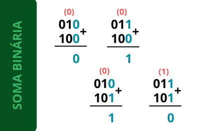
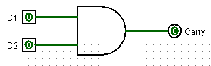
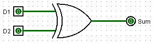
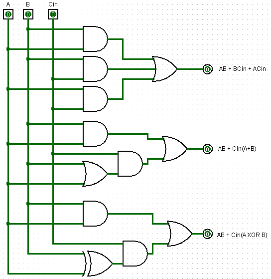
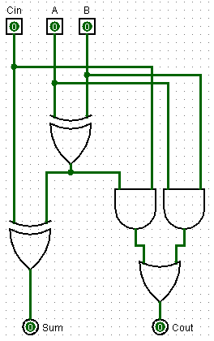

## Adder

### Decimais

Ao realizar uma soma de dois dígitos, na base decimal, que resultem em um número maior que 9 é necessário carregar o dígito de peso 1 para o próximo conjunto de dígitos à esquerda.

> 59 + 27

A soma deve ser iniciada pelo dígito mais à direita e então caminhar até a outra extremidade. Sendo assim o primeiro passo seria somar `9 com 7`

```
9 +
7
= 16
soma-0 = 6
carregar-0 = 1
```
Desta forma é concluído que a soma é igual a 16, no entanto, por necessitar representar a soma em apenas um dígito, é dito que a **soma é 6** (dígito à direita) e será necessário **carregar 1** para a próxima etapa.

```
5 +
2 +
carregar-0 (1)
soma-1 = 8
carregar-1 = 0
```

> Concatenar: carregar(n-1) com soma-(n-1), soma-(n-2), ..., soma-0

*sendo n a quantidade de dígitos*

> 085

Portanto, a soma de números decimais realizada no cotidiano, de forma subconsciente, exemplificada no passo a passo, é definida dessa maneira.

*O carry, quando necessário, será sempre 1 pois no sistema decimal a soma de dois diferentes dígitos pode alcancar no máximo o valor 18.*

### Binárias

A partir do momento em que foi definido que os computadores seguiriam uma lógica de dois valores, ou seja, uma base binária, foi possível criar circuitos capazes de realizar cálculos. A soma deste tipo de sistema numérico segue a mesma lógica descrita para a soma decimal.

Todavia, o que antes era necessário carregar um dígito quando a soma ultrapasse 9, agora é necessário ao passo que a soma de dois dígitos extrapole 1.

Em um exemplo de soma de dois números binários é possível observar a lógica que informa o valor da soma e quando é necessário carregar um dígito para a próxima soma.



Ao observar os 4 diferentes cenários, o **carry** (carregar representado acima do próximo dígito) só tem valor de alto nível lógico quando **ambos** dígitos estão em **1**, ou seja, trata-se de uma lógica **AND**. Sendo assim, a representação do carry pode ser apresentada da seguinte forma:



Por outro lado, a **soma**, representada no inferior da conta, se comporta de maneira identica a uma porta **XOR**. A soma só apresentará 1 quando **um ou outro** for 1, caso ambos sejam 1 a soma é 0 e é carregado 1 para a próxima etapa - como visto anteriormente.



## Full Adder

Nota-se então que é necessário, ao realizar uma soma binária, ter conhecimento do carry. Portanto a soma deve, além do input do conjunto de bits, ter uma entrada que informará o carry da operação passada.

De tal maneira é denotado o `Full Adder` (o exemplo anterior é conhecido como half adder, por desprezar um input de carry), o qual apresenta um esquemático mais complicado que a demonstração acima. Para tal é necessário a construção da tabela verdade que regula este circuito.

| Dígio 1 | Dígito 2 | Carry input | **Sum** | **Carry output** |
|:-:|:-:|:-:|:-:|:-:|
| 0 | 0 |  0  | **0** |  **0**   |
| 0 | 0 |  1  | **1** |  **0**   |
| 0 | 1 |  0  | **1** |  **0**   |
| 0 | 1 |  1  | **0** |  **1**   |
| 1 | 0 |  0  | **1** |  **0**   |
| 1 | 0 |  1  | **0** |  **1**   |
| 1 | 1 |  0  | **0** |  **1**   |
| 1 | 1 |  1  | **1** |  **1**   |

Para a simplificação de **sum**, é construído um mapa que respeite a quantidade de entradas. Para um conjunto de 3 entradas existe um total de 8 possibilidades (2³), ou seja, é necessário um mapa com também 8 espaços (4x2 ou 2x4). Um exemplo de um mapa 2x4 que abrange todas as ocasiões está demonstrado logo abaixo.

||D1|D1|D1'|D1'||
|:---:|:---:|:---:|:---:|:---:|:---:|
|**D2**|111[7]|110[6]|010[2]|011[3]|
|**D2'**|101[5]|100[4]|000[0]|001[1]|
||**Cin**|**Cin'**|**Cin'**|**Cin**||

Substituindo os valores, é obtido a seguinte perspectiva:

||D1|D1|D1'|D1'||
|:---:|:---:|:---:|:---:|:---:|:---:|
|**D2**|1||1||
|**D2'**||1||1|
||**Cin**|**Cin'**|**Cin'**|**Cin**||

Como visto no arquivo de [simplificação](./03-Simplificacao.md) é visado o maior conjunto de 1's ou 0's, todavia o presente mapa não apresenta sequer uma dupla. Sendo assim, será necessário analisar de forma mais *manual*.

### REDUÇÃO Sum

```
D1'*D2'*Cin + 
D1'*D2*Cin' + 
D1*D2'*Cin' + 
D1*D2*Cin
```

- Passo 1

Em uma primeira instância é vantajoso definir um termo comum entre as equações. Nas 2 primeiras linhas ¬D1 é a variável compartilhada, enquanto nas 2 últimas esse termo é o D1.

```
D1'(D2'*Cin + D2*Cin') + 
D1 (D2'*Cin' + D2*Cin)
```

- Passo 2

Uma vez obtido esses padrões, **A.¬B + ¬A.B** e/ou **A.B + ¬A.¬B**, é possibilitado uma leitura diferent que pode auxiliar em uma redução ainda maior. Estes padrões podem ser simplificados para **A XOR B** e **A XNOR B**, respectivamente.

Construindo uma tabela verdade a respeito da `primeira função`, observa-se uma igualdade com a referente ao comportamento de um circuito lógico XOR.

|A|B|S = A'B + A*B'|
|:-:|:-:|:-:|
|0|0|**0**|
|0|1|**1**|
|1|0|**1**|
|1|1|**0**|

```
(0, 0) = 0'0 + 00' = 1.0 + 0.1 = 0
(0, 1) = 0'1 + 01' = 1.1 + 0.0 = 1
(1, 0) = 1'0 + 10' = 0.0 + 1.1 = 1
(1, 1) = 1'1 + 11' = 0.1 + 1.0 = 0
```

Acerca da `segunda função`, tem-se a seguinte tabela verdade:

|A|B|S = A'B' + A*B|
|:-:|:-:|:-:|
|0|0|**1**|
|0|1|**0**|
|1|0|**0**|
|1|1|**1**|

```
(0, 0) = 0'0' + 00 = 1.1 + 0.0 = 1
(0, 1) = 0'1' + 01 = 1.0 + 0.1 = 0
(1, 0) = 1'0' + 10 = 0.1 + 1.0 = 0
(1, 1) = 1'1' + 11 = 0.0 + 1.1 = 1
```

Nesta ocasião o comportamento é como a negação da tabela anterior, apresentando saída de alto nível quando ambas as entradas são de mesmo nível lógico. Sendo assim é possível dizer que esta função representa uma NOT XOR, ou simplesmente XNOR.

*Ao montar um circuito se deve atentar para a diferença de **a NOT XOR b** para  **NOT a XOR NOT b**, visto que apresentam soluções completamente diferentes mas que costumam ser confundidas*

```
D1' (D2 XOR Cin) + 
D1 (D2 XNOR Cin)
```

- Passo 3

A fim de reduzir ainda mais o esquemático, é definido o conjunto `D2 XOR Cin` como X (variável qualquer, apenas para remanejar) e, portanto, `D2 XNOR Cin` como ¬X. Sendo assim, a função deve ficar como **D1'X + D1X'**.

Portanto, como visto que esse padrão pode ser escrito como **D1 XOR X**, a função simplificada, de maneira final, é definida por:

```
D1 XOR D2 XOR Cin
```

- Conclusão

Isto posto, sempre que o mapa de Karnaugh apresentar aquele pattern será possível, mesmo sem definir conjuntos de 1's ou 0's, determinar que a função que rege aquela tabela obdece: `a XOR b XOR c XOR ...`.

Assim, o circuito correspondente ao sum será **Dígito 1 XOR Dígito 2 XOR Carry input**.

### REDUÇÃO Cout

||D1|D1|D1'|D1'||
|:---:|:---:|:---:|:---:|:---:|:---:|
|**D2**|1[d1, d2, d3]|1[d1]||1[d2]|
|**D2'**|1[d3]||||
||**Cin**|**Cin'**|**Cin'**|**Cin**||

Dupla 1: D1.D2

Dupla 2: D2.Cin

Dupla 3: D1.Cin

De tal forma o circuito a representar o Carry Output seria: **D1D2 + D2Cin + D1Cin** ou, após determinar termo em comum, **D1D2 + Cin(D2 + D1)**

Outra forma de solucionar seria descartando as duplas d2 e d3, obtendo então D1D2 + D1'D2Cin + D1D2'Cin. Finalizando por meio desta análise, é estabelecido que D1D2 + Cin(D1'D2 + D1D2') - obtido ao evidenciar Cin - corresponde a **D1D2 + Cin(D1 XOR D2)**. As 3 maneiras podem ser visualizadas na figura abaixo.



O último modelo de circuito é comumente visto uma vez que possibilita reaproveitar a saída da XOR, inicialmente pensada para a saída *sum*, na formação de um full adder. De tal maneira a esquematização unitária de circuito desses, contendo 2 bits e o bit de carry, se assemelha ao circuito a seguir.

