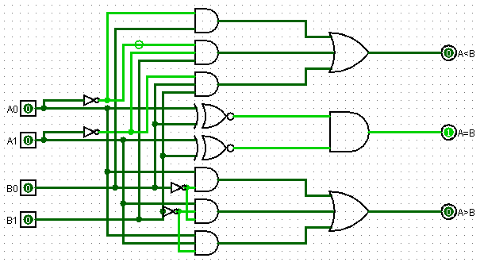
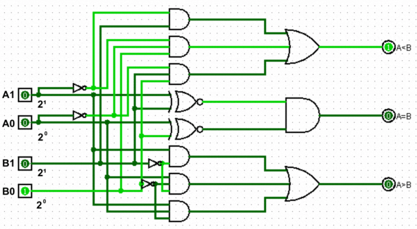

## Comparator

Um comparador é um circuito digital combinacional designado a comparar 2 entradas de n-bits. Por padrão é comum disponibilizar 3 saídas de bit único.

|A1|A0|B1|B0||A<B|A=B|A>B|
|:-:|:-:|:-:|:-:|:-:|:-:|:-:|:-:|
|0|0|0|0||0|1|0|
|0|0|0|1||1|0|0|
|0|0|1|0||1|0|0|
|0|0|1|1||1|0|0|
|0|1|0|0||0|0|1|
|0|1|0|1||0|1|0|
|0|1|1|0||1|0|0|
|0|1|1|1||1|0|0|
|1|0|0|0||0|0|1|
|1|0|0|1||0|0|1|
|1|0|1|0||0|1|0|
|**1**|**0**|**1**|**1**||**1**|**0**|**0**|
|1|1|0|0||0|0|1|
|1|1|0|1||0|0|1|
|1|1|1|0||0|0|1|
|1|1|1|1||0|1|0|

Uma vez com a tabela definida é possível definir o circuito necessário para a aplicação de cada saída desejada. Na construção deste mapa foi levado em conta os pesos de cada dígito: A1 e B1 possuem peso 2 (2¹), enquanto A0 e B0 possuem peso 1. Na linha 12 (destacada em negrito), por exemplo, é dito que B é maior que A pois B está representando o dígito 3(2 + 1) no sistema decimal ao passo que A está representando o dígito 2 (2 + 0).

### OUTPUT: A < B

||A1|A1|A1'|A1'|||
|:---:|:---:|:---:|:---:|:---:|:---:|:---:|
|**A0**||||1|**B0**|
|**A0**||||1|**B0'**|
|**A0'**||||1|**B0'**|
|**A0'**|1||1|1|**B0**|
||**B1**|**B1'**|**B1'**|**B1**|||

Ao obter o conjunto de 1's e verificando as variáveis que se mantém em comum entre tais conjuntos é possível obter as seguintes simplificações: 

Quadra: `A1' * B1` / Dupla 1: `A0' * A1' * B0` / Dupla 2: `A0' * B1 * B0`

Por conta do meio escolhido para a redução ser o de **MINTermos** as expressões obtidas devem ser relacionadas por meio de operações OR.

> **(A1' * B1) + (A0' * A1' * B0) + (A0' * B1 * B0)**

### OUTPUT: A = B

||A1|A1|A1'|A1'|||
|:---:|:---:|:---:|:---:|:---:|:---:|:---:|
|**A0**|1||1||**B0**|
|**A0**|||||**B0'**|
|**A0'**|1||1||**B0'**|
|**A0'**|||||**B0**|
||**B1**|**B1'**|**B1'**|**B1**|||

Nesta ocasião não é possível obter nem sequer uma dupla, sendo então necessário escrever individualmente os valores. Após obter as 4 expressões será possível reduzir por meio de simplificações já mostradas ao longo dos outros arquivos.

(A1 * A0 * B1 * B0) + (A1' * A0 * B1' * B0) + (A1 * A0' * B1 * B0') + (A1' * A0' * B1' * B0') ``> Distributiva``

A0.B0 (A1.B1 + A1'.B1') + A0'.B0'(A1.B1 + A1'.B1') ``> Relação XNOR``

A0.B0 (A1 XNOR B1) + A0'B0' (A1 XNOR B1) ``> Substituição de conjunto repetitivo¹``

A1 XNOR B1 = y;

A0.B0.y + A0'.B0'y ``> Distributiva``

y (A0.B0 + A0'.B0') ``> Relação XNOR``

y (A0 XNOR B0) ``> Desfazer substituição``

> **(A1 XNOR B1) * (A0 XNOR B0)**

### OUTPUT: A > B

||¬B1|¬B1|B1|B1|||
|:---:|:---:|:---:|:---:|:---:|:---:|:---:|
|**¬A1**|||||**¬A0**|
|**¬A1**|1||||**A0**|
|**A1**|1|1||1|**A0**|
|**A1**|1|1|||**¬A0**|
||**¬B0**|**B0**|**B0**|**¬B0**|||

Na construção deste mapa de karnaugh foi adotado uma simbologia diferente. Antes utilizado o símbolo ``'`` para representar o complemento da variável, agora foi empregado o uso de ``¬``. Iniciando a identificação dos conjuntos e então relacionando as expressões é possível obter a seguinte expressão:

Quadra: `A1 * ¬B1` / Dupla 1: `A0 * ¬B1 * ¬B0`  / Dupla 2: `A1 * A0 * ¬B0`

> **(A1 * ¬B1) + (A0 * ¬B1 * ¬B0) + (A1 * A0 * ¬B0)**

### CIRCUITO

Ao verificar alguns exemplos de entradas, alterando os bits de entradas (A1, A0, B1 e B0), fica possível visualizar o comportamento do circuito da maneira pretendida e programada.

[Voltar](06-Adder.md) / [Continuar](11-Decodificador.md)

---

¹ *Não necessário, apenas para melhor visualização*