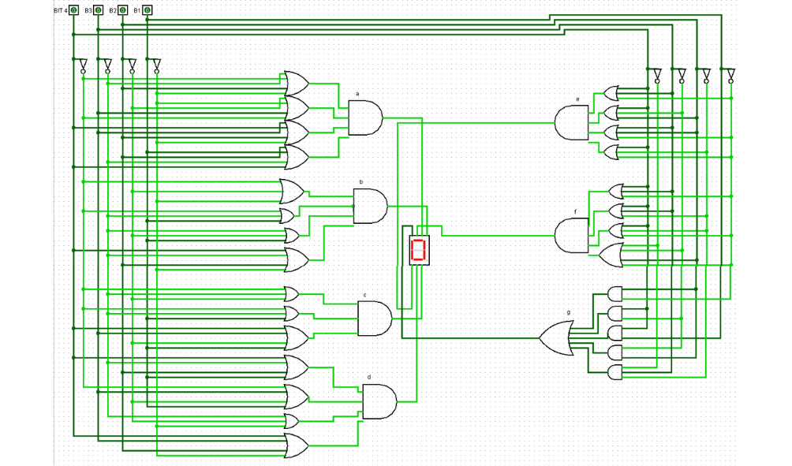

## **Decodificador 7-Display-Segment**

Um decodificador atua para traduzir a informação binária para uma base desejada, ou seja, funciona para obter informação a partir de um código. Vale ressaltar que podem existir criptografias¹ nestes trechos, sendo assim não necessariamente a decodificação é feita no decorrer deste arquivo.


A viabilização deste decodificador, por meio do uso de portas lógicas, em um ambiente físico exigiria um espaço considerável, por conta disso a sua aplicação foi feita através de um simulador: **LogSim** - todavia qualquer outro, o qual possua as caracterísitcas e ferramentas utilizadas, poderia ser utilizado.

### **Esquematização**

A esquematização ocorre pela análise das entradas do sistema e a avaliação de como elas inferem na saída, construindo assim uma tabela verdade. Para este exemplo, tem-se que as saídas serão destinadas aos diferentes segmentos do display e com as entradas referenciando os 4 bits responsáveis por informar o número:


De tal forma, observa-se a seguinte tabela verdade:

|Dígito|BIT 4|BIT 3|BIT 2|BIT 1|a|b|c|d|e|f|g|
|:---:|:---:|:---:|:---:|:---:|:---:|:---:|:---:|:---:|:---:|:---:|:---:|
|0|**0**|**0**|**0**|**0**|||||||0|
|1|**0**|**0**|**0**|**1**||1|1|||||
|2|**0**|**0**|**1**|**0**|||0|||0||
|3|**0**|**0**|**1**|**1**|||||0|0||
|4|**0**|**1**|**0**|**0**|0|||0|0|||
|5|**0**|**1**|**0**|**1**||0|||0|||
|6|**0**|**1**|**1**|**0**||0||||||
|7|**0**|**1**|**1**|**1**|1|1|1|||||
|8|**1**|**0**|**0**|**0**|1|1|1|1|1|1|1|
|9|**1**|**0**|**0**|**1**|||||0|||
|A|**1**|**0**|**1**|**0**||||0||||
|B|**1**|**0**|**1**|**1**|0|0||||||
|C|**1**|**1**|**0**|**0**||0|0||||0|
|D|**1**|**1**|**0**|**1**|0|||||0||
|E|**1**|**1**|**1**|**0**||0|0|||||
|F|**1**|**1**|**1**|**1**||0|0|0||||

Uma vez obtida a tabela, é possível realizar a redução da função através do Mapa de Karnaugh; assim chegando em:

````
a: (B4' + B3' + B2 + B1') * (B4' + B3 + B2' + B1') * (B4 + B3 + B2 + B1') * (B4 + B3' + B2 + B1)

b: (B4' + B2' + B1') * (B4' + B3' + B1) * (B3' + B2' + B1) * (B4 + B3' + B2 + B1')

c: (B4' + B3' + B2') * (B4' + B3' + B1) * (B4 + B3 + B2' + B1)

d: (B4 + B3' + B2 + B1) * (B4' + B3 + B2' + B1) * (B3' + B2' + B1') * (B4 + B3 + B2 + B1')

e: (B4 + B3 + B1') * (B4 + B3' + B2) * (B3 + B2 + B1') * (B4 + B2' + B1')

f: (B4 + B3 + B1') * (B4 + B3 + B2') * (B4 + B2' + B1') * (B4' + B3' + B2 + B1')

g: (B2 * B1') + (B4 * B3') + (B4 * B1) + (B3' * B2) + (B4' * B3 * B2')

````



[Voltar](04-CircuitoSeq.md) / [Continuar](12-PartidaEAlarme.md)

---

¹ *Um exemplo básico de codificador, não utilizado como criptografia, é o excesso 3. Tabela de código excesso 3:*

|Decimal|Excesso 3|
|:---:|:---:|
|0|0011|
|1|0100|
|2|0101|
|3|0110|
|4|0111|
|5|1000|
|6|1001|
|7|1010|
|8|1011|
|9|1100|