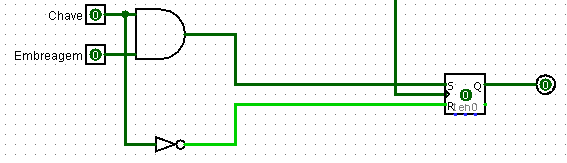

## **Acionamento de motor e alarme de carro**

Estado 1 (antes de ligar):

|Embreagem|Chave Partida|PARTIDA|
|:---:|:---:|:---:|
|**0**|**0**|0|
|**0**|**1**|0|
|**1**|**0**|0|
|**1**|**1**|1|

```
MOTOR(PARTIDA) = Embreagem * Chave Partida
```

Estado 2 (após ligado):

|Embreagem|Chave Partida|PARTIDA|
|:---:|:---:|:---:|
|**0**|**0**|0|
|**0**|**1**|1|
|**1**|**0**|0|
|**1**|**1**|1|

---

|Motor|Porta|Cinto|Farol|ALARME|LED|
|:---:|:---:|:---:|:---:|:---:|:---:|
|**0**|**0**|**0**|**0**|0|0|
|**0**|**0**|**0**|**1**|0|1|
|**0**|**0**|**1**|**0**|0|0|
|**0**|**0**|**1**|**1**|0|1|
|**0**|**1**|**0**|**0**|0|1|
|**0**|**1**|**0**|**1**|0|1|
|**0**|**1**|**1**|**0**|0|1|
|**0**|**1**|**1**|**1**|0|1|
|**1**|**0**|**0**|**0**|0|0|
|**1**|**0**|**0**|**1**|0|0|
|**1**|**0**|**1**|**0**|1|0|
|**1**|**0**|**1**|**1**|1|0|
|**1**|**1**|**0**|**0**|1|0|
|**1**|**1**|**0**|**1**|1|0|
|**1**|**1**|**1**|**0**|1|1|
|**1**|**1**|**1**|**1**|1|1|

*Porta (0) = Fechada; Porta(1) = Aberta*

*Cinto (0) = Em uso; Cinto(1) = Solto*

*Farol (0) = Apagado; Farol(1) = Aceso*

```
ALARME = (Motor * Cinto) + (Motor * Porta)

LED = (Motor' * Farol) + (Motor' * Porta)
```

Através da leitura da tabela verdade se nota que sem o acionamento do motor o alerta ocorre apenas com a sinalização visual (LED). Enquanto isso, quando o motor ligado, o alerta base é o sonoro, o qual é acionado em situações em que a porta e/ou cinto estejam em posição errada. Por fim, o duplo alerta (alarme + LED), é requisitado quando, com o motor ligado, existam 2 problemas pertinentes (porta e cinto inadequados).

Após conceituar a ideia e apresentar as funções, chega-se em uma conclusão: é necessário uma memória para que não seja necessário manter a chave na posição correta e a embreagem acionada para o motor não desligar.

Tal implementação pode ser dada por um simples flip-flop SR, no qual a entrada **set** pode ser definida por meio da função descrita acima e o **reset** ser acionado pela descrita pelo estado 2.



[Voltar](11-Decodificador.md) / [Continuar](21-ClockRegistrador.md)